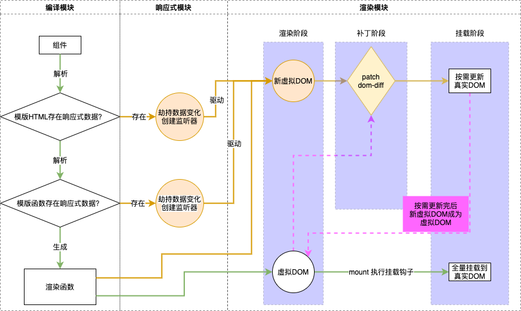

## mini-vue

-   响应式模块 `ReactivityModule`
    -   依赖收集 `depend`
    -   依赖通知 `notify`
-   编译模块 `CompileModule`
    -   模版编译成渲染函数 `h`
-   渲染模块 `RenderModule`
    1. 渲染阶段 `render`
        - 渲染函数生成虚拟节点 `vnode`
    2. 挂载阶段 `mount`
        - 虚拟节点挂载到真实节点
    3. 补丁阶段 `patch`
        - 对比两个新旧虚拟节点并更新到真实节点 `dom-diff`
            - `diff-tag`
            - `diff-props`
            - `diff-children`

## mini-vue 工作流程



## mini-vue-html

-   响应式模块 ref、reactive、watchEffect

```js
// JS单线程；当前调用栈里唯一活动的副作用函数
let activeEffect;

// ==========================================
// ===> ref
// ==========================================

class Ref {
    constructor(value) {
        this._value = value;
        this.effectList = new Set();
    }
    get value() {
        this.depend();
        return this._value;
    }
    set value(value) {
        this._value = value;
        this.notify();
    }
    depend() {
        if (activeEffect) {
            this.effectList.add(activeEffect);
        }
    }
    notify() {
        this.effectList.forEach((effect) => {
            effect();
        });
    }
}

const ref = (value) => new Ref(value);

// ==========================================
// ===> reactive
// ==========================================

class Dep {
    constructor() {
        this.effectList = new Set();
    }
    depend() {
        if (activeEffect) {
            this.effectList.add(activeEffect);
        }
    }
    notify() {
        this.effectList.forEach((effect) => {
            effect();
        });
    }
}

const targetMap = new WeakMap();

const getDep = function (target, key) {
    let depMap = targetMap.get(target);
    if (!depMap) {
        depMap = new Map();
        targetMap.set(target, depMap);
    }
    let dep = depMap.get(key);
    if (!dep) {
        dep = new Dep();
        depMap.set(key, dep);
    }
    return dep;
};

const reactive = function (obj) {
    let handler = {
        get(target, key) {
            const dep = getDep(target, key);
            const value = Reflect.get(...arguments);
            dep.depend();
            return typeof value === "object"
                ? new Proxy(value, handler)
                : value;
        },
        set(target, key, value) {
            const dep = getDep(target, key);
            const res = Reflect.set(...arguments);
            dep.notify();
            return res;
        },
    };
    return new Proxy(obj, handler);
};

// ==========================================
// ===> watchEffect
// ==========================================

const watchEffect = function (effect) {
    activeEffect = effect;
    effect();
    activeEffect = null;
};
```

-   模版字符串解析成渲染函数 h

```js
// 此处简化实现逻辑，直接使用 h
const h = function (tag, props, children) {
    return {
        tag,
        props,
        children,
    };
};
```

```html
<style>
    .red {
        color: red;
    }
    .blue {
        color: blue;
    }
</style>

<div id="app"></div>

<script>
    // ==========================================
    // ===> 模版解析
    // ==========================================

    const h = function (tag, props, children) {
        return {
            tag,
            props,
            children,
        };
    };

    // ==========================================
    // ===> DOM DIFF
    // ==========================================

    const diffProps = function (oldVnode, newVnode, el) {
        const oldProps = oldVnode.props || {};
        const newProps = newVnode.props || {};

        // 更新 prop
        for (const key in newProps) {
            const oldValue = oldProps[key];
            const newValue = newProps[key];
            if (oldValue !== newValue) {
                if (key.startsWith("on")) {
                    const fnName = key.slice(2).toLocaleLowerCase();
                    oldValue && el.removeEventListener(fnName, oldValue);
                    el.addEventListener(fnName, newValue);
                } else {
                    el.setAttribute(key, newValue);
                }
            }
        }

        // 删除 prop
        for (const key in oldProps) {
            if (!newProps.hasOwnProperty(key)) {
                el.removeAttribute(key);
            }
        }
    };

    const diffChildren = function (oldVnode, newVnode, el) {
        if (typeof newVnode.children === "string") {
            if (typeof oldVnode.children === "string") {
                if (newVnode.children !== oldVnode.children) {
                    // string string
                    el.textContent = newVnode.children;
                }
            } else {
                // children string
                el.textContent = newVnode.children;
            }
        } else {
            if (typeof oldVnode.children === "string") {
                // string children
                el.innerHTML = null;
                newVnode.children.forEach((child) => {
                    el.appendChild(child.el);
                });
            } else {
                // children children
                const oldChildren = oldVnode.children || [];
                const newChildren = newVnode.children || [];
                const minLen = Math.min(oldChildren.length, newChildren.length);
                // 交集处理
                for (let i = 0; i < minLen; i++) {
                    patch(oldChildren[i], newChildren[i], el);
                }
                // 新增员工处理
                if (newChildren.length > oldChildren.length) {
                    let list = newChildren.slice(oldChildren.length);
                    list.forEach((child) => mount(child, el));
                } else {
                    // 新减员工处理
                    let list = oldChildren.slice(newChildren.length);
                    list.forEach((child) => el.removeChild(child.el));
                }
            }
        }
    };

    const patch = function (oldVnode, newVnode, parentEle) {
        if (oldVnode.tag === newVnode.tag) {
            el = newVnode.el = oldVnode.el;
            diffProps(oldVnode, newVnode, el);
            diffChildren(oldVnode, newVnode, el);
        } else {
            parentEle.replaceChild(mount(newVnode), oldVnode.el);
        }
    };

    // ==========================================
    // ===> mount
    // ==========================================

    const mount = function (vnode, container) {
        const { tag, props, children } = vnode;
        const el = (vnode.el = document.createElement(tag));
        if (typeof props === "object") {
            for (const key in props) {
                const value = props[key];
                if (key.startsWith("on")) {
                    const fnName = key.slice(2).toLocaleLowerCase();
                    el.addEventListener(fnName, value);
                } else {
                    el.setAttribute(key, value);
                }
            }
            if (typeof children === "string") {
                el.textContent = children;
            } else {
                children.forEach((child) => {
                    mount(child, el);
                });
            }
        }

        container && container.appendChild(vnode.el);

        return el;
    };

    // ==========================================
    // ===> 发布订阅
    // ==========================================

    let activeEffect;
    class Ref {
        constructor(value) {
            this._value = value;
            this.effectList = new Set();
        }
        get value() {
            this.depend();
            return this._value;
        }
        set value(value) {
            this._value = value;
            this.notify();
        }
        depend() {
            if (activeEffect) {
                this.effectList.add(activeEffect);
            }
        }
        notify() {
            // debugger;
            this.effectList.forEach((effect) => {
                effect();
            });
        }
    }

    class Dep {
        constructor() {
            this.effectList = new Set();
        }
        depend() {
            if (activeEffect) {
                this.effectList.add(activeEffect);
            }
        }
        notify() {
            // debugger;
            this.effectList.forEach((effect) => {
                effect();
            });
        }
    }

    // ==========================================
    // ===> ref
    // ==========================================

    const ref = (value) => new Ref(value);

    // ==========================================
    // ===> reactive
    // ==========================================

    const targetMap = new WeakMap();

    const getDep = function (target, key) {
        let depMap = targetMap.get(target);
        if (!depMap) {
            depMap = new Map();
            targetMap.set(target, depMap);
        }
        let dep = depMap.get(key);
        if (!dep) {
            dep = new Dep();
            depMap.set(key, dep);
        }
        return dep;
    };

    const reactive = function (obj) {
        let handler = {
            get(target, key) {
                const dep = getDep(target, key);
                const value = Reflect.get(...arguments);
                dep.depend();
                return typeof value === "object"
                    ? new Proxy(value, handler)
                    : value;
            },
            set(target, key, value) {
                const dep = getDep(target, key);
                const res = Reflect.set(...arguments);
                dep.notify();
                return res;
            },
        };
        return new Proxy(obj, handler);
    };

    // ==========================================
    // ===> watchEffect
    // ==========================================

    const watchEffect = function (effect) {
        activeEffect = effect;
        effect();
        activeEffect = null;
    };

    // ==========================================
    // ===> 测试代码
    // ==========================================

    const App = {
        count: ref(0),
        obj: reactive({
            bool: {
                value: false,
            },
        }),
        render() {
            const { count, obj } = this;

            const p = () => h("p", {}, "p元素");
            const div = () => h("div", {}, "div元素");
            const span = () => h("span", {}, "span元素");
            const arr = (bool) =>
                bool ? [p(), div(), span()] : [span(), div()];

            return h(
                "div",
                {
                    onClick: () => {
                        count.value++;
                        obj.bool.value = !obj.bool.value;
                    },
                },
                [
                    h(
                        "div",
                        { class: obj.bool.value ? "red" : "blue" },
                        "当前数字: " + String(count.value)
                    ),
                    h("div", {}, arr(obj.bool.value)),
                ]
            );
        },
    };

    const mountApp = function (component, container) {
        let isMounted = false;
        let vnode;

        watchEffect(() => {
            if (!isMounted) {
                vnode = component.render();
                mount(vnode, container);
                isMounted = true;
                console.log("mount");
            } else {
                const newVnode = component.render();
                patch(vnode, newVnode, container);
                vnode = newVnode;
                console.log("patch");
            }
        });
    };

    mountApp(App, document.querySelector("#app"));
</script>
```
