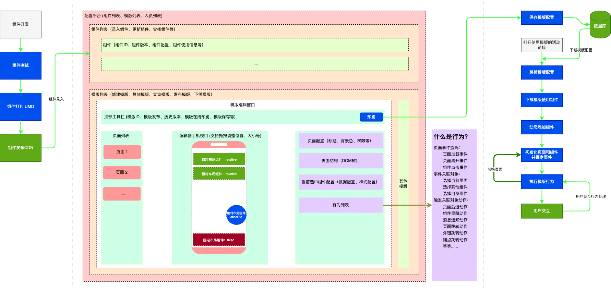

# 低代码活动配置平台

---



## 配置 Scheme

### 模版配置

```json
{
    // 模版唯一标识
    "template_id": 1,
    // 模版页面列表
    "template_pages": []
}
```

### 页面配置

```json
{
    // 页面唯一标识
    "page_id": 1,
    // 页面标题
    "page_title": "",
    // 页面描述
    "page_description": "",
    // 页面默认样式
    "page_style": {},
    // 页面组件列表
    "page_components": [],
    // 页面行为列表
    "page_behaviors": []
}
```

### 组件配置

```json
{
    // 组件唯一标识
    "component_id": 1,
    // 组件自定义名称
    "component_title": "",
    // 组件默认样式
    "component_orign": {},
    // 组件默认样式
    "component_style": {},
    // 组件默认数据
    "component_bind": {},
    // 组件嵌套组件
    "component_children": []
}
```

### 行为配置

```json
{
    // 行为唯一标识
    "behavior_id": 1,
    // 行为自定义名称
    "behavior_title": "",
    // 行为触发事件
    "behavior_event": "load/click/leave",
    // 行为触发来源
    "behavior_source": "id",
    // 行为响应动作列表
    "behavior_children": [
        {
            // 响应对象
            "behavior_target": "",
            // 响应动作
            "behavior_action": "",
            // 动作执行成功的后续动作
            "behavior_action_success": [],
            // 动作执行失败的后续动作
            "behavior_action_failed": []
        }
    ]
}
```

## 特色 Future

## 难点

## 优化

## 收益
